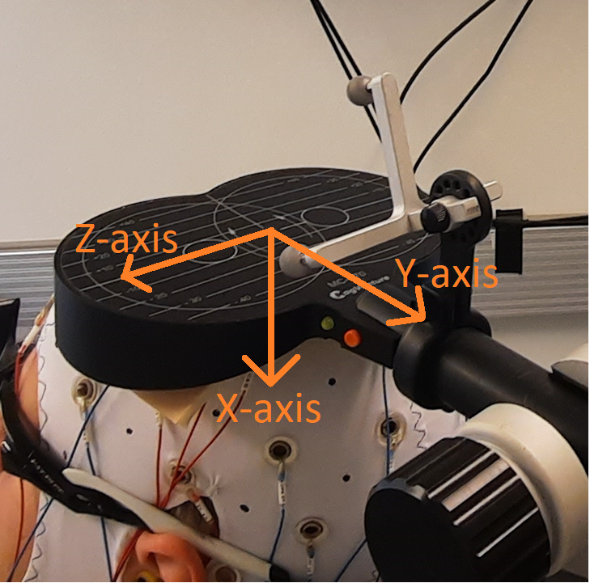

# Localite TMS Coil Displacement

Simple Matlab code to calculate both the **translational displacement** and **angular displacement** of a TMS coil relative to a specified instrument marker created in Localite TMS navigator software.

- **Translational Displacement**: How far the TMS coil has moved from the specified instrument marker.
- **Angular Displacement**: Rotation of the TMS coil relative to the original orientation of the specified instrument marker.

- Translational and angular displacements are expressed in local coordinate system of the specified instrument marker.

- **Localite instrument markers** can be found from 'InstrumentMarkers'-folder withing each sessions data folder. Typically the last instrumentMarker-file contains all the instrument markers of a given session.
- **Localite trigger markers** can be found from 'TMSTrigger'-folder withing each sessions data folder. 'TriggerMarkers_Coil0'-files are the trigger markers for coil 1, and 'TriggerMarkers_Coil1'-files are the trigger markers for coil 2.

## Example

-See example.m for usage 

## Simple UI available for non-programmers
- Run 'CoilDisplacementUI' in Matlab command window
-> Select instrumentmarker file
-> Select instrumentmarker description
-> Select trigger file
-> export to .xlsx

## Localite coil axes

  

